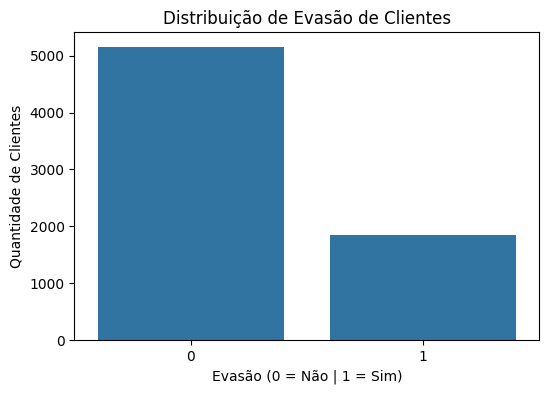
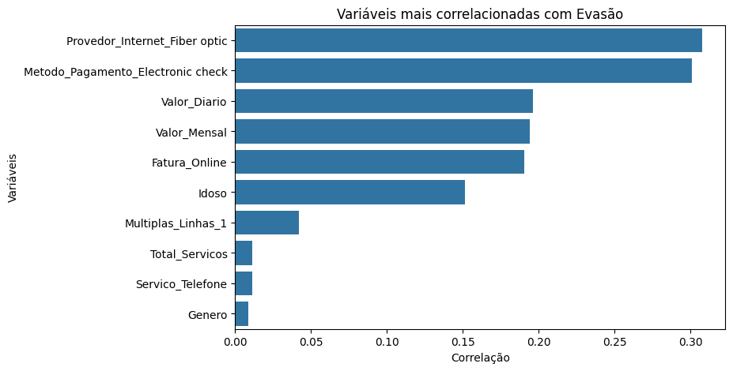
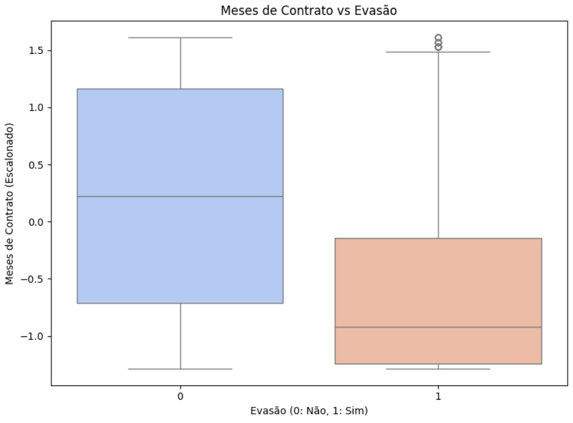

# 📊 Telecom X – Churn Prediction

Projeto de **Ciência de Dados** que utiliza técnicas de **Machine Learning** para prever a evasão de clientes (*churn*) em uma empresa de telecomunicações.

A partir da análise de dados históricos, foram identificados padrões relevantes de comportamento e desenvolvido um modelo capaz de **identificar clientes com maior risco de cancelamento**, permitindo a criação de estratégias de retenção mais eficientes.

📓 **Notebook principal:**  
`challenge3_TelecomX_Churn_Prediction.ipynb`

---

# 🎯 Objetivo do Projeto

O objetivo deste projeto é **prever quais clientes possuem maior probabilidade de cancelar o serviço**, permitindo que a empresa adote ações preventivas de retenção.

Com isso, a empresa pode:

- reduzir perdas de receita  
- aumentar o tempo de relacionamento com clientes  
- maximizar o **Lifetime Value (LTV)** da base de clientes  

---

# 📂 Dataset

O projeto utiliza o dataset:

`TelecomX_Dados_Processados.csv`

A base contém informações sobre clientes da empresa, incluindo:

- tipo de contrato
- serviços contratados
- valor mensal do serviço
- tempo de relacionamento (tenure)
- método de pagamento
- variável alvo: **Evasão (Churn)**

A base apresenta **desbalanceamento natural**, com aproximadamente:

| Classe | Quantidade | Proporção |
|------|------|------|
| Não Evadiu | 5153 | 73.5% |
| Evadiu | 1857 | 26.5% |

---

# ⚙️ Metodologia e Desenvolvimento

O pipeline de dados foi estruturado para garantir **boa interpretabilidade e eficiência na modelagem**.

### Dataset

Utilização do arquivo `TelecomX_Dados_Processados.csv`, contendo dados já limpos e estruturados para análise.

### Pré-processamento

Foram aplicadas técnicas de preparação dos dados:

- **StandardScaler** para padronização das variáveis numéricas  
- **One-Hot Encoding** para transformação das variáveis categóricas em formato numérico  

### Balanceamento (SMOTE)

Devido ao desbalanceamento da base (aproximadamente **26% de churn**), foi aplicada a técnica **SMOTE (Synthetic Minority Over-sampling Technique)** durante o treinamento para reduzir o viés em relação à classe majoritária.

### Modelo Selecionado

O modelo final escolhido foi **Regressão Logística**, que alcançou **Recall de 0.80**.

Neste contexto, priorizou-se a capacidade de **identificar clientes com risco de evasão**, já que **perder um cliente ativo gera um custo maior do que abordar um cliente que talvez não cancelaria**.

---

# 📊 Análise Exploratória dos Dados (EDA)

Durante a **Exploratory Data Analysis (EDA)** foram investigados padrões de evasão e relações entre variáveis do dataset.

### Distribuição de Evasão



A análise inicial confirmou um desbalanceamento natural na variável alvo, com aproximadamente 26,5% dos clientes que cancelaram o serviço.

Esse comportamento justificou a aplicação posterior da técnica SMOTE durante a etapa de modelagem para evitar viés na previsão da classe minoritária.

---

### Variáveis Mais Correlacionadas com Evasão



O gráfico de correlação revelou algumas das principais variáveis associadas ao churn, como:

- uso de Fibra Óptica
- método de pagamento Electronic Check
- valor mensal do serviço
- tempo de contrato (tenure)

Esses fatores ajudam a identificar possíveis padrões de comportamento relacionados ao cancelamento do serviço.
A análise de correlação indicou variáveis com maior relação com churn, incluindo:

---

### Tempo de Contrato vs Evasão



O gráfico indica que clientes com **menor tempo de relacionamento com a empresa apresentam maior probabilidade de evasão**.

Os **primeiros meses de contrato representam o período mais crítico**, enquanto clientes com maior tempo de permanência tendem a permanecer no serviço.

---

# 🤖 Modelagem Preditiva

Foram avaliados diferentes algoritmos de classificação para prever a evasão de clientes.

### Modelos avaliados

- Regressão Logística
- Random Forest

Para lidar com o desbalanceamento da base, foi aplicada a técnica **SMOTE** durante o treinamento.

### Comparação de desempenho

| Modelo | Acurácia | Precisão | Recall | F1-Score |
|------|------|------|------|------|
| Regressão Logística (Base) | 0.81 | 0.68 | 0.56 | 0.62 |
| Random Forest (SMOTE) | 0.76 | 0.53 | 0.61 | 0.57 |
| Regressão Logística (SMOTE) | 0.75 | 0.52 | 0.80 | 0.63 |

O modelo **Regressão Logística com SMOTE** foi escolhido como solução final.

Apesar de apresentar acurácia menor, ele alcançou **Recall de 0.80**, sendo capaz de identificar **80% dos clientes com risco de evasão**.

---

# 📈 Principais Fatores de Evasão

A análise revelou três fatores principais associados ao churn.

### Tipo de Contrato

Clientes com **contratos mensais** apresentam maior probabilidade de cancelamento.

Contratos de **1 ano ou 2 anos** funcionam como **mecanismos de retenção**, reduzindo significativamente o risco de evasão.

---

### Internet Fibra Óptica

Clientes que utilizam **fibra óptica** apresentaram maiores taxas de evasão em comparação com usuários de **DSL**.

Possíveis fatores associados:

- percepção de custo elevado
- possíveis problemas de qualidade do serviço
- maior sensibilidade ao preço

---

### Tempo de Relacionamento (Tenure)

Os **primeiros 12 meses** representam a fase de maior risco de evasão.

Clientes que permanecem além desse período tendem a desenvolver maior fidelização com o serviço.

---

# 💡 Estratégias de Retenção Propostas

Com base nos padrões identificados nos dados, foram propostas três estratégias principais.

### Incentivo a Contratos de Longo Prazo

Campanhas para migrar clientes de planos mensais para contratos anuais oferecendo:

- descontos
- upgrade de velocidade
- benefícios de fidelidade

---

### Programa de Qualidade da Fibra Óptica

Realização de auditorias técnicas em regiões com maiores taxas de evasão e revisão da política de preços do serviço.

---

### Monitoramento do Primeiro Ano de Cliente

Implementação de pesquisas de satisfação (**NPS**) nos meses:

- 3
- 6
- 9

O objetivo é identificar problemas precocemente e aumentar a retenção de clientes.

---

# 📁 Estrutura do Projeto

```
telecom-churn-prediction/

├── challenge3_TelecomX_Churn_Prediction.ipynb
├── TelecomX_Dados_Processados.csv
├── images/
│   ├── distribuicao_evasao.png
│   ├── correlacao_evasao.png
│   └── tenure_vs_churn.png
└── README.md
```

---

# 🛠️ Tecnologias Utilizadas

- Python  
- Pandas  
- NumPy  
- Matplotlib  
- Seaborn  
- Scikit-learn  
- Imbalanced-learn (SMOTE)  

---

## 👨‍💻 Autor

**Artur Soares**  
Estudante de **Ciência da Computação — UFPB**

Programa **Oracle Next Education (ONE)**  
Trilha **Data Science**
